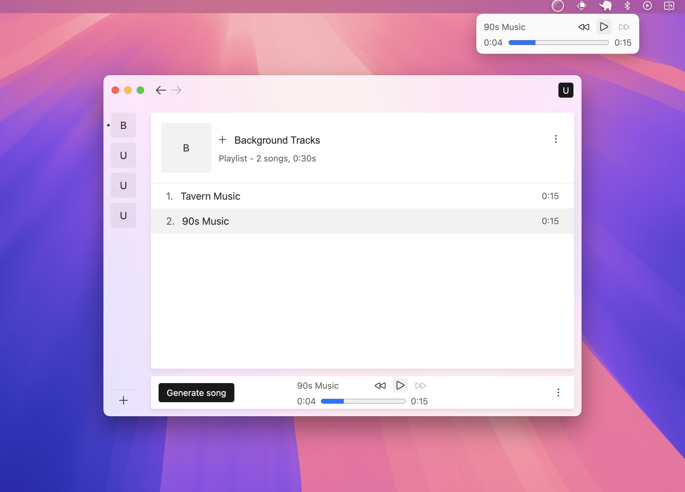

# Sera

This repository contains multiple week-long projects that integrate the [ElevenLabs API](https://elevenlabs.io/) in some way.

## Player

The [Music Player](packages/player/README.md) is a simple spotify-like app that uses the ElevenLabs API to generate background music. While basic from a UI perspective, this example involves complex state management and replication across windows, a from-scratch component library, and a CI/CD process that involves smoke testing the app on Mac/Windows/Linux to guarantee that it can successfully auto-update. It wook about a week of work.

Visit the project [README](packages/player/README.md) to learn more.

## Launcher

The [Launcher](packages/launcher/README.md) is a raycast-like panel app that is instantly accessible with the `Command`+`Shift`+`Space` keyboard combination. It demonstrates how sound effects can be quickly generated and pasted into background applications. It's architecturally much simpler than the [Music Player] as it doesn't involve any state management and reuses the [Radix UI](https://www.radix-ui.com/) component library. It took about a day of work.

Visit the project [README](packages/launcher/README.md) to learn more.

## Project 3 (Todo)
