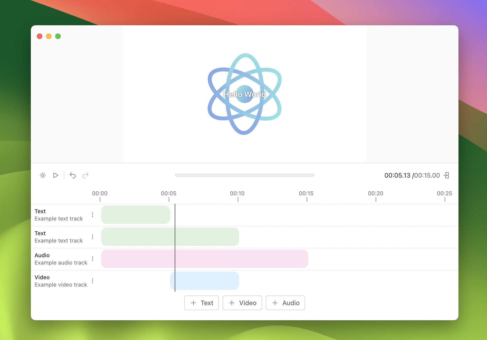
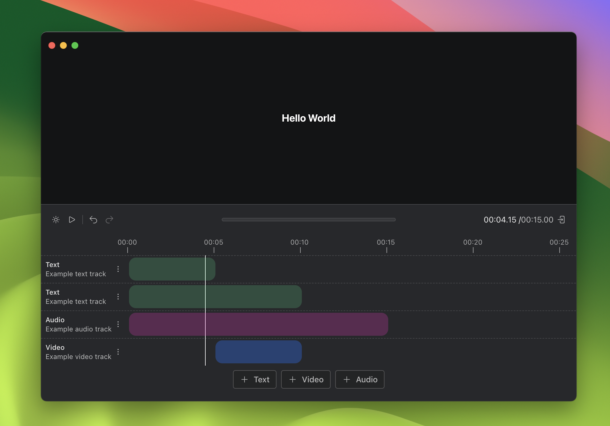

# Editor

A simple video editor that combines text, audio, and video channels.



## Goals

The goal of this project was to experiement with some of the toolchain around creating a video editor. I was particularly interested in seeing how well [remotion](packages/editor/README.md) would work as a library. The main challenges were:

- Getting remotion to render videos locally, meaning I can avoid having to render the videos on remote servers.
- Understanding how to represent different data types (video, audio, text) in a timeline that can be interacted with intuitively (via drag and drop for example).

Unlike the other projects, this one involved heavier dependence on third-party libraries in order to get the project done in one week.

## Get Started

To get started, run the following from the project's directory.

```
# install dependencies
yarn

# Run the app in development mode
yarn dev
```

## Structure

Unlike the other projects, I decided to separate out the `electron` logic into a different folder. This was because I wanted to create a clearer separate between what `remotion` was doing on the server and what it was doing on the client.


