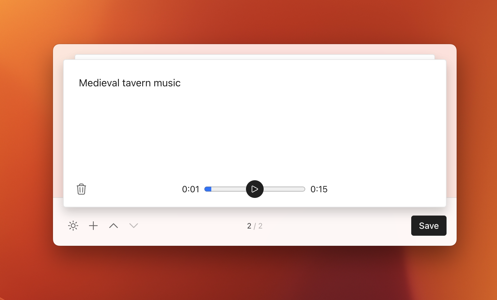
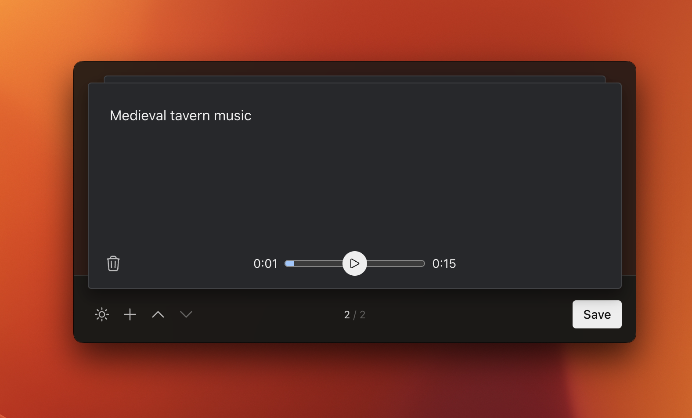

# Launcher

A simple raycast-like app for quickly generating sound effects



## Goals

The goal of this project was to provide insight into how quickly I can prototype functional applications. Unlike the [Music Player](../player/README.md), the architecture is much simpler as I didn't spend time on complex state management or support for multiple windows.

Importantly, the launcher demonstrates how music can be quickly generated in context and pasted into other desktop applications. E.g. I could be in Final Cut Pro, hit a keyboard shortcut to bring up the launcher, and paste the generated sound effects back into Final Cut Pro.

## Get Started

To get started, run the following from the project's directory.

```
# install dependencies
yarn

# Run the app in development mode
yarn dev
```

Once running, enter your ElevenLabs [access token](https://elevenlabs.io/) to log in. You can then enter a prompt and click the "Generate" button to create a sound effect that you can then drag and drop into any other app.

## Structure

Each project folder within the `src` directory helps define a core piece of the project:

- `main`: This directory corresponds to the electron main process. This is responsible for defining the panel window and setting up the global keyboard shortcut.
- `preload`: This directory contains files for setting up a preload script that runs before the panel UI is loaded into an appliation window (necessary for security purposes).
- `renderer`: This directory contains the entry TypeScript for the panel window. The UI for these windows is implemented in React. Instead of creating a custom `components`, `patterns` and `views` library to separate component logic (like is done with the [Music Player](../player/README.md)), I decided to just keep the majority of cards in the `renderer/MainApp.tsx` file.


