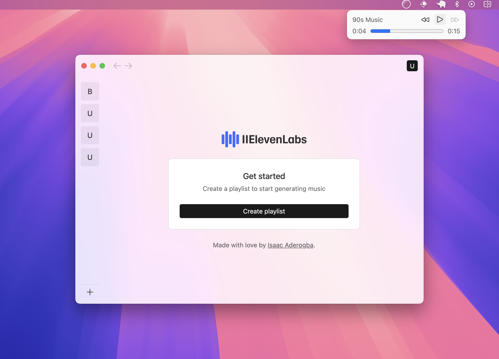
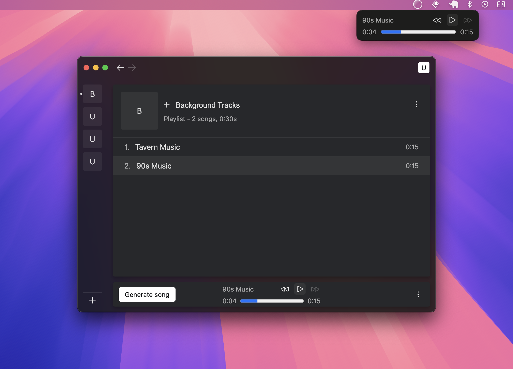

# Music Player

A simple spotify-like app for playing generated background msuic.



## Goals

The goal of this project was to provide an overall perspective on how I tackle projects. While the Project has a simple UI, it is actually the most involved of the projects because it involves state management and replication across windows, a from-scratch component library, and a CI/CD process that involves smoke testing the app on Mac/Windows/Linux to guarantee that it can successfully auto-update.

The other projects in this repo might look more impressive, but are much simpler architecturally.

## Get Started

To get started, run the following from the project's directory.

```
# install dependencies
yarn

# Run the app in development mode
yarn dev
```

Once running, enter your ElevenLabs [access token](https://elevenlabs.io/) to log in. You can then create custom playlists and use the "Generate song" button to generate background music according to your desired prompt.

## Architecture

Each project folder within the `src` directory helps define a core piece of the project:

- `main`: This directory corresponds to the electron main process. This is responsible for connecting to the SQLIte database, defining the core application windows, and handling the app's IPC communication layer.
- `renderer`: This directory contains the entry TypeScript for the "Main" application window and the accessory "Menubar" window. The UI for these windows is implemented in React.
- `preload`: This directory contains files for setting up a preload script that runs before the Main/Menubar app is loaded into an appliation window (necessary for security purposes). These files also define the IPC communication contract that the main and renderer process need to adhere by.
- `components`: This directory contains files for a custom React component library.
- `patterns`: This directory contains files for reusable components that are built on top of the base library.
- `views`: This directory contains the main user interface views, reusing code from the previously-defined patterns..
- `hooks`: This directory contains reusable hooks such as `useValidations` which is used to support custom validation (the `Form` component uses this, for example).
- `utilities`: This directory contains utility code that is used across the project.


